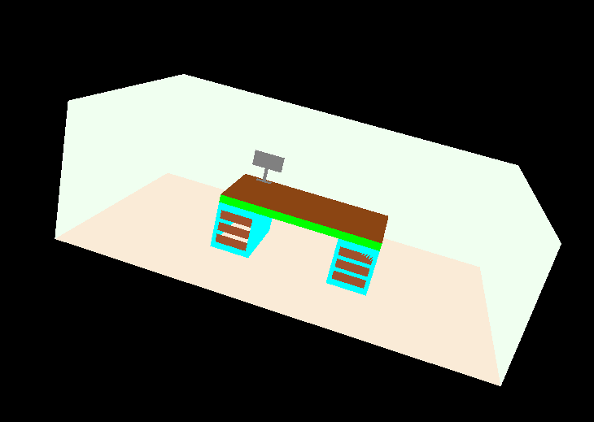
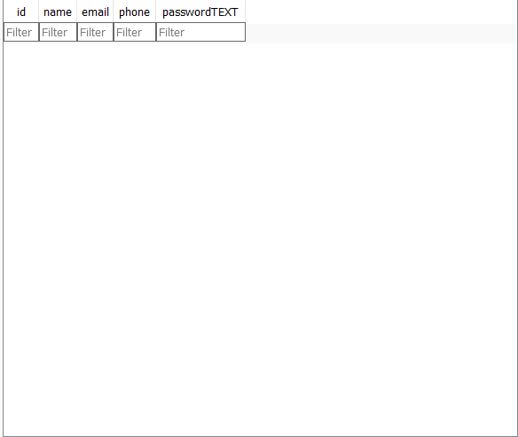
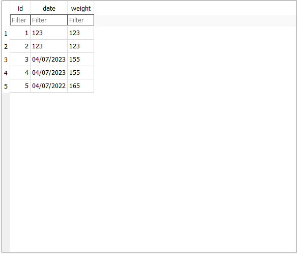

# Southern New Hampshire University <br> Computer Science Capstone
## <center>Professional Self Assesment<center>
It has been a very long road for me in my journey as a Computer Science Major at Southern New Hampshire University, but I have finally made it to the end. The Computer Science program has broadened my skillset as a problem solver, a developer, a critical thinker, and most importantly as a future computer science professional. <br>
<br>
Developing my ePortfolio gave me time to think back on how I got to where I am now. I have always felt that one of my biggest strengths when it comes to computer science is being well-organized. When you are working on complex projects or even smaller quick tasks, you need to have a plan of action. For me, starting small was the best way to approach any computer science project, especially when it came to projects that were built using unfamiliar IDEs. This is how I approached my ePortfolio, and I think its final state is one to be proud of. <br>
<br>
My three artifacts, as you see below, are a culmination of my deep understanding and proficiency in 3 subject areas. These areas are Software Design and Engineering, Algorithms and Data Structures, and Databases. Personally, I enjoyed Software Design and Engineering the most as it allowed me to use my creative side and really make something of my own. Developing code and software is a very strictly controlled set of rules, regardless of what language you are using, so anytime I am able to put some of my creativity into it, I try to gravitate towards that aspect the most. While developing my application, I not only found a deeper understanding of the Java language but found several areas that interested me so much that I decided to start smaller side projects just to see what kind of interesting things I could do with the language. Overall, my artifacts highlight several areas of my expertise, particularly when it comes to artifacts 1 and 3, as they were developed together as my application grew. Integrating several parts of the application when it comes to the design and how that aligns with the databases shows my understanding of the need for multiple parts of a project to work together to create a larger final picture.  <br>
<br> 
I was also able to gain significant knowledge in team collaboration, stakeholder communication, and security. I enjoy working with a team, as I strongly believe that no one person can have all of the answers and no one person is able to hold the special key that can get it all done. Working in a team environment promotes development far beyond what a single person can accomplish, as many minds working as one can find different problems, more complex ways of achieving goals, and a more thorough dive into the project at hand. I was particularly fond of one of my earlier core classes where we were encouraged to look into the pull requests of other students in order to review and comment on their code to ensure that the integration of their portion of the project was going to mesh with the rest of it. This gave me a unique insight into how others develop code in their own way, showing an almost personal touch to an otherwise rigid field of science. Learning about stakeholder communication was another area that really piqued my interest, as you have to find a way to both convey and highlight deeper stages of software development with individuals who may not have the same subject matter knowledge as you. This allowed me to critically think about how I was going to deliver project outlines, milestone reports, and final reports to high-level stakeholders, one of which will be the client who may have no knowledge of the ways the software development lifecycle goes. <br>
<br>
I look forward to the next chapter of my education and learning experience as I know that my journey has just begun in the Computer Science world. My time these pasts years at South New Hampshire University has given me the tools to start, succeed, and excel in any industry I find myself in. <br>

## <center>CODE REVIEW<center>
A code review is one of the most important aspects of development. Code reviews are designed to identify bugs, increase code quality, and help developers learn the source code. On top of this, it is also a stage that promotes team collaboration. New ideas, suggestions, or possible solutions to problems can all be brought up during these reviews. This ensures that the direction of the project has a clear path toward success. <br>
***Click [here](https://youtu.be/XGRvyJ8Ayr0) to view my code review***

## <center>ARTIFACTS<center>
#### ARTIFACT 1: Software Design and Engineering 
For the first artifact of this project, I chose to enhance my layout and overall design of a Weight Tracking application that I had started in a previous class. The purpose of this app is to track a user's daily weight toward their goal weight. When I started with this artifact, it did have a layout, but overall, I did not have a very good sense of direction and usability from a user-friendly standpoint. While menus were there, nothing was intuitively laid out to a point where a user would be able to easily infer how to operate the application. I first revamped my main screen, adding a toolbar to house 3 other clickable buttons. I also set a layout on the bottom of the main screen to house another button that would act as the starting point for the application. I selected this item because I thought that I could do an overall better job of having a more user-positive experience. I wanted to take elements from applications I had used in the past and implement some of the features I liked. One of the biggest features from a design standpoint was the ability to click an image rather than a button in order to transition to another screen. I think that it is a cleaner way to display the option of going to another menu or screen as an image can not only convey what the button might do, but the image can also tie in the overall look of the application. The most evident learning experience I had regarding this artifact was looks vs. usability. While something may look clean when presented on a graphic, that doesn't always constitute a direct correlation to the ability of that element to be user-friendly. I realized just how much time goes into creating simple yet usable layouts. <br> 
<br> 

Below is an example of the old main screen (Top) and new main screen (Bottom) in order to showcase the improved design <br>
  <br>
***Click [here](https://github.com/luchh224/luchh224.github.io/tree/main/Weight%20Loss%20App/Code%20Review/Layouts) to view the original layout files*** <br> 
***Click [here](https://github.com/luchh224/luchh224.github.io/tree/main/Weight%20Loss%20App/Layouts) to view the enhanced layout files***
#### ARTIFACT 2: Algorithms and Data Structures
The algorithm and data structures artifact is one that made me dig deeper into my past classes to find a project that was working but could use a boost in efficiency. I decided to use a lower-level OpenGL scene that I created in my CS-330 Computational Graphics and Visualization class. The scene consists of a desk, walls, and a computer monitor on top of the desk, all created using 2D coordinates that when combined together made a 3D scene complete with camera positions that can be moved and changed using your mouse and WASD keys. Below is a screenshot of my original 3D scene. <br>
 <br>
While the overall scene is not going to change other than colors, the structure with which I write and implement the code will change. As mentioned above, each element of the scene is created using 2D planes, with each plane having 2 triangles within it to create 4 sides. Each triangle in the original code shared 2 of the same X, Y, and Z coordinates out of 6 total coordinates, leading to the redundancy of coordinates that were already called out. My goal is to scrub and rewrite the code so that the objects can be created using the individual coordinates once instead of twice. While the original code works and does represent the shapes that I would like them to represent, the efficiency with which the program runs and renders can be cut down significantly which would also create a more efficient coding experience as there will be less time aligning and positioning hundreds of coordinates throughout the scene. The scene will still be created using triangles, but using the method GLushort indices[], it will allow me to call each coordinate of the scene, and then call these corners to form triangles and eventually rectangles. Instead of needing 3 coordinates per triangle, which tally to 6 coordinates for a rectangle, I was able to enhance the code so that each triangle still uses 3 coordinates, but instead of having one coordinate per line, all three coordinates are on one line, calling them back to the GLfloat verts[] method instead, which is where the coordinates originate from. Altogether my enhancement was able to eliminate 155 lines of unnecessary code. <br>
<br>
Below are inline entries of the original code (top) versus the enhanced code (bottom).<br>
<br>

In the original code, there are only 3 shapes in the form of 2D planes being made on this portion which in this case are 3 walls. This method requires 18 lines of code just for the coordinates alone to create only 3 shapes.<br>
```   
         //Left Wall
         -2.5f, 1.5f, 1.0f,    0.941f, 1.0f, 0.941f, 1.0f,
         -2.5f, 1.5f,-0.6f,    0.941f, 1.0f, 0.941f, 1.0f,
         -2.5f,-1.5f,-0.6f,    0.941f, 1.0f, 0.941f, 1.0f,
         -2.5f, 1.5f, 1.0f,    0.941f, 1.0f, 0.941f, 1.0f,
         -2.5f,-1.5f,-0.6f,    0.941f, 1.0f, 0.941f, 1.0f,
         -2.5f,-1.5f, 1.0f,    0.941f, 1.0f, 0.941f, 1.0f,

         //Back Wall
         2.5f, 1.5f, 1.0f,     0.941f, 1.0f, 0.941f, 1.0f,
         2.5f, 1.5f,-0.6f,     0.941f, 1.0f, 0.941f, 1.0f,
        -2.5f, 1.5f,-0.6f,     0.941f, 1.0f, 0.941f, 1.0f,
         2.5f, 1.5f, 1.0f,     0.941f, 1.0f, 0.941f, 1.0f,
        -2.5f, 1.5f,-0.6f,     0.941f, 1.0f, 0.941f, 1.0f,
        -2.5f, 1.5f, 1.0f,     0.941f, 1.0f, 0.941f, 1.0f,

         //Right Wall
         2.5f,-1.5f, 1.0f,     0.941f, 1.0f, 0.941f, 1.0f,
         2.5f,-1.5f,-0.6f,     0.941f, 1.0f, 0.941f, 1.0f,
         2.5f, 1.5f,-0.6f,     0.941f, 1.0f, 0.941f, 1.0f,
         2.5f,-1.5f, 1.0f,     0.941f, 1.0f, 0.941f, 1.0f,
         2.5f, 1.5f,-0.6f,     0.941f, 1.0f, 0.941f, 1.0f,
         2.5f, 1.5f, 1.0f,     0.941f, 1.0f, 0.941f, 1.0f,
```
<br>

In the enhanced code, we have 20 lines of code that create 20 different coordinate points on the scene. These points are responsible for building the entirety of the desktop as well as the towers on the left and right of the desk, effectively allowing for the creation of 18, 2D planes with only 2 more lines of code than the original code. We also see here how the GLushort indices[] method creates these shapes. Instead of writing the coordinates of each side of the triangle, this method is taking the already assigned numbers for each point and joins them to form a triangle all on one line rather than 3 lines like in the original code, allowing for the creation of a 2D plane on just 2 lines of code in this method. <br>
``` 
        // Vertex Positions    // Colors (r,g,b,a)
        // These are all points to form the desktop, as well as the individual points for the towers that house the drawers
         1.0f,  0.5f, 0.0f,   0.545f, 0.271f, 0.075f, 1.0f, // Point A = 0
         1.0f, -0.5f, 0.0f,   0.545f, 0.271f, 0.075f, 1.0f, // Point B = 1
        -1.0f, -0.5f, 0.0f,   0.545f, 0.271f, 0.075f, 1.0f, // Point C = 2
        -1.0f,  0.5f, 0.0f,   0.545f, 0.271f, 0.075f, 1.0f, // Point D = 3

        -1.0f,  0.5f,  0.2f,  0.545f, 0.271f, 0.075f, 1.0f, // Point E = 4
         1.0f,  0.5f,  0.2f,  0.545f, 0.271f, 0.075f, 1.0f, // Point F = 5
        -1.0f, -0.5f,  0.2f,  0.545f, 0.271f, 0.075f, 1.0f, // Point G = 6
         1.0f, -0.5f,  0.2f,  0.545f, 0.271f, 0.075f, 1.0f, // Point H = 7

        -1.0f, -0.5f, -0.6f,  1.0f,   0.0f,   0.0f,   1.0f, // Point I = 8
        -0.5f, -0.5f, -0.6f,  1.0f,   0.0f,   0.0f,   1.0f, // Point J = 9
        -1.0f,  0.5f, -0.6f,  1.0f,   0.0f,   0.0f,   1.0f, // Point K = 10
        -0.5f,  0.5f, -0.6f,  1.0f,   0.0f,   0.0f,   1.0f, // Point L = 11

        -0.5f, -0.5f,  0.0f,  1.0f,   1.0f,   0.0f,   1.0f, // Point M = 12
        -0.5f,  0.5f,  0.0f,  1.0f,   1.0f,   0.0f,   1.0f, // Point N = 13
         0.5f,  0.5f,  0.0f,  1.0f,   1.0f,   0.0f,   1.0f, // Point O = 14
         0.5f, -0.5f,  0.0f,  1.0f,   1.0f,   0.0f,   1.0f, // Point P = 15

         0.5f, -0.5f, -0.6f,  1.0f,   1.0f,   1.0f,   1.0f, // Point Q = 16
         0.5f,  0.5f, -0.6f,  1.0f,   1.0f,   1.0f,   1.0f, // Point R = 17
         1.0f, -0.5f, -0.6f,  1.0f,   1.0f,   1.0f,   1.0f, // Point S = 18
         1.0f,  0.5f, -0.6f,  1.0f,   1.0f,   1.0f,   1.0f, // Point T = 19

    // Index data to share position data
    GLushort indices[] = {
        //These points will create the desktop into a 3D piece. All sides will be brown
        0, 1, 2,   // Triangle 1
        2, 3, 0,   // Triangle 2
        4, 5, 7,  //  Triangle 3
        4, 6, 7,   // Triangle 4
        0, 7, 1,   // Triangle 5
        7, 0, 5,   // Triangle 6
        4, 2, 3,   // Triangle 7
        4, 2, 6,   // Triangle 8
        6, 1, 2,   // Triangle 9
        6, 1, 7,   // Triangle 10
        5, 3, 0,   // Triangle 11
        5, 3, 4,   // Triangle 12
```
<br>
The best part about this enhancement though is the ability to reuse in a sense all of the coordinates for different areas of the scene. If at any point a new shape intersects with one of the coordinates, there is no need to create a new coordinate, all you need to do is call out the assigned number of the coordinate in order to get your triangle to jump to that particular Point. <br>
<br>
    
***Click [here](https://github.com/luchh224/luchh224.github.io/blob/main/OpenGl%20/OldCode.cpp) to view the original .cpp file***<br> ***Lines 364 - 644 are exclusive to the building blocks of the scene***<br>
***Click [here](https://github.com/luchh224/luchh224.github.io/blob/main/OpenGl%20/NewCode.cpp) to view the enhanced .cpp file***<br> ***Lines 361 - 503 are exclusive to the building blocks of the scene***
#### ARTIFACT 3: Databases
For the final artifact of the project, my goal was to create two separate databases for the weight loss application that I had started in a previous course. The first database was created in order to add user accounts to it on the register screen of the application. This screen would need to be accessed if there was no user account in the database for that particular username and password.  The second database was going to be used while in the application and needed to house the weight and date information for the user that was logged in. I decided to use two databases for this instead of one inside of another because it was easier to modify the databases as I developed them.  The hardest part about creating these databases was keeping track of all of the variables needed for all of the different methods that I created. In order to track all that was going on, I created an Excel spreadsheet that had my variables for each different Java class as well as where it would link to within the database versus the Java classes they were created for. <br>
Below you will find images of what both of the databases look like. Using DBbroswer, I am able to extract the created database from the application and open it to view. On creation of the database, this is the data that is created for users to input information into. Note that there is test information within the database for the Weight information that includes dates and weights. <br> 
  <br>
***Click [here](https://github.com/luchh224/luchh224.github.io/tree/main/Weight%20Loss%20App/Databases) to view the enhanced database files*** 
## <center>OUTCOMES<center>
The 5 outcomes that I was striving to achieve during this final project are: <br>
<br>
    1. Strategies for building collaborative environments that enable diverse audiences to support organizational decision-making in the field of computer science. <br> 
    <br>
    2. Design, develop, and deliver professional-quality oral, written, and visual communications that are coherent, technically sound, and appropriately adapted to specific audiences and contexts. <br> 
    <br>
    3. Design and evaluate computing solutions that solve a given problem using algorithmic principles and computer science practices and standards appropriate to its solution, while managing the trade-offs involved in design choices. <br> 
    <br>
    4. Demonstrate an ability to use well-founded and innovative techniques, skills, and tools in computing practices for the purpose of implementing computer solutions that deliver value and accomplish industry-specific goals. <br> 
    <br>
    5. Develop a security mindset that anticipates adversarial exploits in software architecture and designs to expose potential vulnerabilities, mitigate design flaws, and ensure privacy and enhanced security of data and resources. <br> 
    <br>
All of these outcomes have been showcased throughout my ePortfolio in the following ways: <br>
<br>
    1. Properly notating all entries within the code to ensure that other developers can understand and build upon the goal of the code. This also includes notating proper changes to pull requests so that other team members can see how it integrates into the larger project at hand as well as have insight as to why a change or new design was implemented.<br>
<br>
    2. The content of the application I have been developing has been presented in a way where it is coherent as well as easy to follow and understand. All content within the application has been thought out to be as user-friendly as possible while also sticking to the overall simplicity of the application itself. It is straightforward without leaving out any areas that may be confusing or prompts written in a way where the user would not understand the purpose of each element. <br>
<br>
    3. I was able to take a past project in the form of a 3D scene and enhance it in a way where I accomplished two things at the same time. The first accomplishment was to scale back code while also maintaining its purpose so that when the program runs the code is more efficient thus leading to less resources needed to run the application. The second accomplishment was to scale back just how much code was needed in order to run the application. Originally there were 283 lines of code needed in order to shape the 3D objects. With the improvement, there are now only 128 lines of code needed in order to shape the 3D objects.<br>
<br>
    4. This outcome was best showcased when working on my databases for the weight tracker application. In it, I demonstrated a very non-nonsense approach the building a database where it was both functional and efficient. The databases also work seamlessly with the user’s input leading to the overall outcome of a properly working database.<br>
<br>
    5. This outcome was also showcased with the databases that I developed, as well as elements of the user end of the application. From a database standpoint, all of the information that the user was entering was held solely on the application without any need to hold this information elsewhere such as the cloud. The information that the user entered, such as phone number, email, and name were all held in a local database that could only be called from the app itself. Likewise with my user-facing portion of the login and register screen, the password entries that the user inputs were blocked out so as to not be visible like the rest of the login information. 

