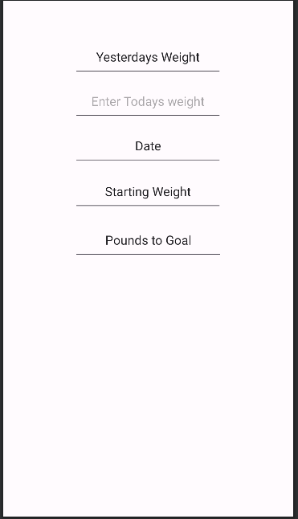
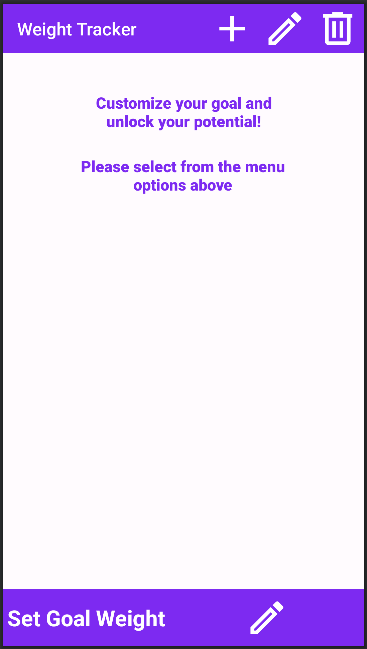

# Southern New Hampshire University   Computer Science Capstone
## 
Table of Contents
Click a link to jump to that section!  
1. [Professional Self Assesment](#pse)
2. Code Review
3. Artifacts
    1. Artifact 1: Software Design and Engineer
    2. Artifact 2: Algorithms and Data Structures
    3. Artifact 3: Databases

## 
Professional Self Assesment

It has been a very long road for me in my journey as a Computer Science Major at Southern New Hampshire University, but I have finally made it to the end. The Computer Science program has broadened my skillset as a problem solver, a developer, a critical thinker, and most importantly as a future computer science professional.  
 
Developing my ePortfolio gave me time to think back on how I got to where I am now. I have always felt that one of my biggest strengths when it comes to computer science is being well-organized. When you are working on complex projects or even smaller quick tasks, you need to have a plan of action. For me, starting small was the best way to approach any computer science project, especially when it came to projects that were built using unfamiliar IDEs. This is how I approached my ePortfolio, and I think its final state is one to be proud of.  
 
My three artifacts, as you see below, are a culmination of my deep understanding and proficiency in 3 subject areas. These areas are Software Design and Engineering, Algorithms and Data Structures, and Databases. Personally, I enjoyed Software Design and Engineering the most as it allowed me to use my creative side and really make something of my own. Developing code and software is a very strictly controlled set of rules, regardless of what language you are using, so anytime I am able to put some of my creativity into it, I try to gravitate towards that aspect the most. While developing my application, I not only found a deeper understanding of the Java language but found several areas that interested me so much that I decided to start smaller side projects just to see what kind of interesting things I could do with the language. Overall, my artifacts highlight several areas of my expertise, particularly when it comes to artifacts 1 and 3, as they were developed together as my application grew. Integrating several parts of the application when it comes to the design and how that aligns with the databases shows my understanding of the need for multiple parts of a project to work together to create a larger final picture.   
  
I was also able to gain significant knowledge in team collaboration, stakeholder communication, and security. I enjoy working with a team, as I strongly believe that no one person can have all of the answers and no one person is able to hold the special key that can get it all done. Working in a team environment promotes development far beyond what a single person can accomplish, as many minds working as one can find different problems, more complex ways of achieving goals, and a more thorough dive into the project at hand. I was particularly fond of one of my earlier core classes where we were encouraged to look into the pull requests of other students in order to review and comment on their code to ensure that the integration of their portion of the project was going to mesh with the rest of it. This gave me a unique insight into how others develop code in their own way, showing an almost personal touch to an otherwise rigid field of science. Learning about stakeholder communication was another area that really piqued my interest, as you have to find a way to both convey and highlight deeper stages of software development with individuals who may not have the same subject matter knowledge as you. This allowed me to critically think about how I was going to deliver project outlines, milestone reports, and final reports to high-level stakeholders, one of which will be the client who may have no knowledge of the ways the software development lifecycle goes.  
 
I look forward to the next chapter of my education and learning experience as I know that my journey has just begun in the Computer Science world. My time these pasts years at South New Hampshire University has given me the tools to start, succeed, and excel in any industry I find myself in.  

## 
CODE REVIEW

A code review is one of the most important aspects of development. Code reviews are designed to identify bugs, increase code quality, and help developers learn the source code. On top of this, it is also a stage that promotes team collaboration. New ideas, suggestions, or possible solutions to problems can all be brought up during these reviews. This ensures that the direction of the project has a clear path toward success.  
***Click [here](https://youtu.be/XGRvyJ8Ayr0) to view my code review***

## 
ARTIFACTS

#### ARTIFACT 1: Software Design and Engineering 
For the first artifact of this project, I chose to enhance my layout and overall design of a Weight Tracking application that I had started in a previous class. The purpose of this app is to track a user's daily weight toward their goal weight. When I started with this artifact, it did have a layout, but overall, I did not have a very good sense of direction and usability from a user-friendly standpoint. While menus were there, nothing was intuitively laid out to a point where a user would be able to easily infer how to operate the application. I first revamped my main screen, adding a toolbar to house 3 other clickable buttons. I also set a layout on the bottom of the main screen to house another button that would act as the starting point for the application. I selected this item because I thought that I could do an overall better job of having a more user-positive experience. I wanted to take elements from applications I had used in the past and implement some of the features I liked. One of the biggest features from a design standpoint was the ability to click an image rather than a button in order to transition to another screen. I think that it is a cleaner way to display the option of going to another menu or screen as an image can not only convey what the button might do, but the image can also tie in the overall look of the application. The most evident learning experience I had regarding this artifact was looks vs. usability. While something may look clean when presented on a graphic, that doesn't always constitute a direct correlation to the ability of that element to be user-friendly. I realized just how much time goes into creating simple yet usable layouts.   
  

Below is an example of the old main screen (Top) and new main screen (Bottom) in order to showcase the improved design  
   
***Click [here](https://github.com/luchh224/luchh224.github.io/tree/main/Weight%20Loss%20App/Code%20Review/Layouts) to view the original layout files***   
***Click [here](https://github.com/luchh224/luchh224.github.io/tree/main/Weight%20Loss%20App/Layouts) to view the enhanced layout files*** 
#### ARTIFACT 2: Algorithms and Data Structures
#### ARTIFACT 3: Databases
For the final artifact of the project, my goal was to create two separate databases for the weight loss application that I had started in a previous course. The first database was created in order to add user accounts to it on the register screen of the application. This screen would need to be accessed if there was no user account in the database for that particular username and password.  The second database was going to be used while in the application and needed to house the weight and date information for the user that was logged in. I decided to use two databases for this instead of one inside of another because it was easier to modify the databases as I developed them.  The hardest part about creating these databases was keeping track of all of the variables needed for all of the different methods that I created. In order to track all that was going on, I created an Excel spreadsheet that had my variables for each different Java class as well as where it would link to within the database versus the Java classes they were created for.  
***Click [here](https://github.com/luchh224/luchh224.github.io/tree/main/Weight%20Loss%20App/Databases) to view the enhanced database files*** 

